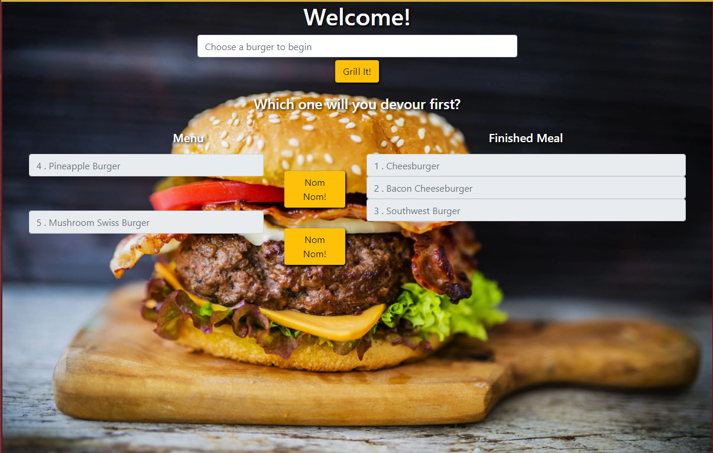

# eatAtJoes

## Table of Contents

[Description](#Description)

[Installation](#Installation)

[Usage](#Usage)

[Licenses](#Licenses)

[Contributors](#Contributors)

[Tests](#Tests)

[Questions](#Questions)

[Link](#Link)

[Screenshots](#Screenshots)

## Description

For this assignment, we were tasked with creating a burger logger with MySQL, Node, Express, Handlebars and a homemade ORM. We were to follow the MVC design pattern; use Node and MySQL to query and route data, and Handlebars to generate our HTML.

## Installation

N/A

## Usage

N/A

## Licenses

N/A

## Contributors

Matt Rikard

## Tests

N/A

## Questions

I can be reached at matthew.rikard@gmail.com for further questions.

## Screenshots

